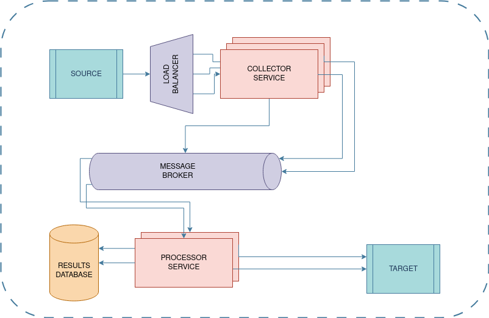
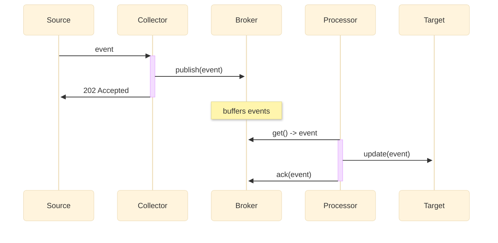

# Event Flow

## Overview

This document describes the assumptions, design details, caveats
and potential improvements of the system. For implementation details,
refer [this](./implementation-details.md).

## Assumptions

* The target rate limit cannot be increased (ex: Shopify API)
* Considering the rate at which the target can consume events is capped,
  it is acceptable for the system to have a temporary lag built up
* While the maximum rate of event generation by the source is higher than
  the target's rate limit, the event generation source varies and can be
  lower than the target at times (without which the target will never catch
  up)
* The target is idempotent
* It is acceptable for the events to be out of order within a short time
  time window (say 60 seconds)
* The target can respond within a acceptable time period (say 5 seconds),
  and any error response is to treated as a failure (warranting a retry)

## Functional Requirements

* All events from the source need to be captured, no event should be lost
* Events that are yet to be pushed to the target have to be buffered
* All events need to be pushed to the target

## Non-functional Requirements

* System needs to be reliable
* System needs to be highly available
* System needs to be able to scale based on varying load from the source
* System needs to be observable: logs, metrics, alerts
* System needs to be traceble: telemetry, tracing

## High Level Design

The diagram belows describes the high-level architecture of the system.

## Sequence Diagram

The diagram describes the interactions between the different components of
the system, as defined in the [high level diagram](#high-level-design).

## Future Improvements

Given the limited time I had available to build this out, I chose to
invest most of the time in the design and implementation. There is a
lot more I would ideally like to build, some of which is listed below:

* As the system matures, the `processor` can evolve to operate on the
  event as well, and update its own database. This is likely to lead to
  the problem of dual writes, and a trasactional outbox implementation
  could be suitable to work around this problem.
* Setting up a results backend for the processor workers would allow
  signigicant visibility into not only the processed events, but also
  the responses received from the target.
* Setup metric monitoring, likely with [Prometheus](https://prometheus.io/)
  and [Grafana](https://grafana.com/oss/grafana/).
* Setup log aggregation, maybe with [Loki](https://grafana.com/oss/loki/)
* Integrate opentelemetry / opentracing, and maybe deploy
  [jeager](https://www.jaegertracing.io/) as well.
